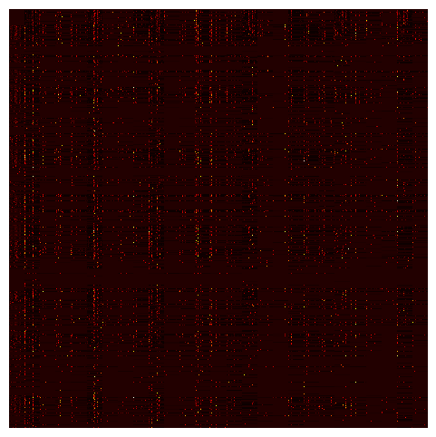

运行日志：

```shell
(llm) PS llm101n-zh\code> python .\01_ngram\ngram.py
seq_len 3 | smoothing 0.03 | train_loss 2.1843 | val_loss 2.2443
seq_len 3 | smoothing 0.10 | train_loss 2.1870 | val_loss 2.2401
seq_len 3 | smoothing 0.30 | train_loss 2.1935 | val_loss 2.2404
seq_len 3 | smoothing 1.00 | train_loss 2.2117 | val_loss 2.2521
seq_len 4 | smoothing 0.03 | train_loss 1.8703 | val_loss 2.1376
seq_len 4 | smoothing 0.10 | train_loss 1.9028 | val_loss 2.1118
seq_len 4 | smoothing 0.30 | train_loss 1.9677 | val_loss 2.1269
seq_len 4 | smoothing 1.00 | train_loss 2.1006 | val_loss 2.2114
seq_len 5 | smoothing 0.03 | train_loss 1.4955 | val_loss 2.3540
seq_len 5 | smoothing 0.10 | train_loss 1.6335 | val_loss 2.2814
seq_len 5 | smoothing 0.30 | train_loss 1.8610 | val_loss 2.3210
seq_len 5 | smoothing 1.00 | train_loss 2.2132 | val_loss 2.4903
best hyperparameters: {'seq_len': 4, 'smoothing': 0.1}
felton
jasiel
chaseth
nebjnvfobzadon
brittan
shir
esczsvn
freyanty
aubren
malanokhanni
jemxebcghhzhnsurias
lam
coock
braeya
leiazie
ilamil
vleck
plgiavae
ahzai
sire
azari
ril
aqqhvtsmerysteena
jena
jo
test_loss 2.106370, test_perplexity 8.218358
wrote datasets/dev\ngram_probs.npy to disk (for visualization)
```

可视化

```python
probs = np.load("ngram_probs.npy")
probs.shape
```
> (27, 27, 27, 27)

```python
assert probs.shape == (27, 27, 27, 27)
reshaped = probs.reshape(27**2, 27**2)
plt.figure(figsize=(6, 6))
plt.imshow(reshaped, cmap='hot', interpolation='nearest')
plt.axis('off')
```

> (-0.5, 728.5, 728.5, -0.5)


