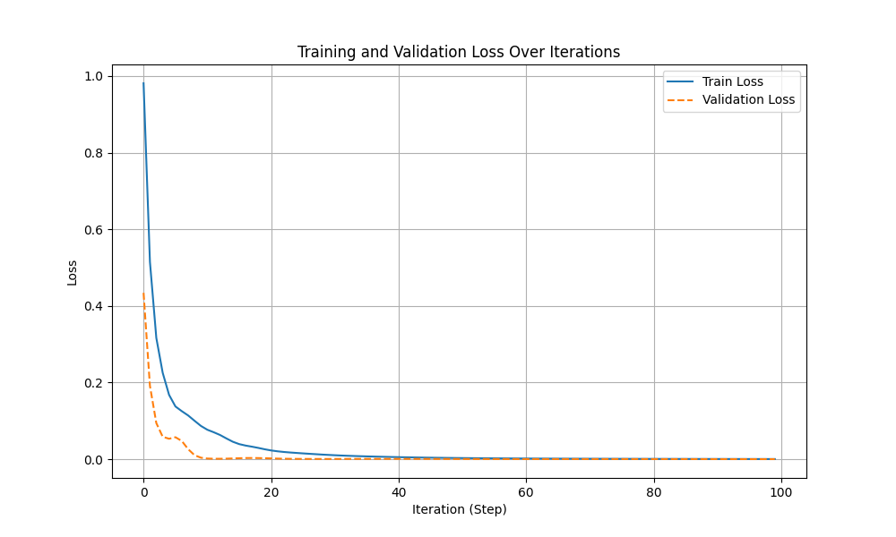

# 2.micro_grad

## 1.介绍

`MicroGrad`是Andrej Karpathy写的一个非常轻量级别的神经网络框架，其基本构成为一个90行python代码的标量反向传播（自动微分）引擎，以及在此基础上实现的神经网络层，代码见[仓库]([karpathy/micrograd](https://github.com/karpathy/micrograd))。

在这个章节中，我们构建了一个微小的“autograd”引擎（自动梯度的缩写），它实现了反向传播算法，这里构建的代码是神经网络训练的核心，它允许在计算应该如何更新神经网络的参数，以便使其在某些任务中做得更好，例如自回归语言模型中的下一个标记预测。所有现代深度学习库（例如 PyTorch、TensorFlow、JAX 等）都使用了这种完全相同的算法，不同之处在于这些库的优化程度更高且功能更丰富。

## 2.梯度

在数学中，梯度是一个矢量函数，表示函数在某点的方向导数的最大值，对于函数的梯度计算公式如下：
$$
\operatorname{grad} f=\left(\frac{\partial f}{\partial x}, \frac{\partial f}{\partial y}, \frac{\partial f}{\partial z}\right)=\frac{\partial f}{\partial x} \vec{i}+\frac{\partial f}{\partial y} \vec{j}+\frac{\partial f}{\partial z} \vec{k}
$$
在深度学习中，梯度被用来描述神经网络中某一层的输出对输入的敏感程度，即权重更新的方向。简单来说，梯度指示了损失函数在参数空间中的变化方向，是优化算法调整模型参数的重要依据。

在深度学习中，梯度更新主要通过反向传播来实现。反向传播是一种通过计算损失函数对神经网络中每一层的偏导数来更新权重的算法。它首先将输入信号向前传播，计算每一层的输出和预期结果的误差，然后反向传播这个误差来逐层调整权重。

反向传播算法的核心是**链式法则**，即后一层的梯度可以通过前一层的梯度乘以相应的权重来计算。

### 2.1 链式法则

在深度学习中，多元函数通常是****复合****（composite）的，链式法则可以被用来微分复合函数。

先考虑单变量函数。假设函数$y=f(u)$和$u=g(x)$都是可微的，根据链式法则：

$$
    \frac{dy}{dx} = \frac{dy}{du} \frac{du}{dx}
$$

现在考虑一个更一般的场景，即函数具有任意数量的变量的情况。

假设可微分函数$y$有变量$u_1, u_2, \ldots, u_m$，其中每个可微分函数$u_i$都有变量$x_1, x_2, \ldots, x_n$。

注意，$y$是$x_1, x_2， \ldots, x_n$的函数。

对于任意$i = 1, 2, \ldots, n$，链式法则给出：

$$
\frac{\partial y}{\partial x_i} = \frac{\partial y}{\partial u_1} \frac{\partial u_1}{\partial x_i} + \frac{\partial y}{\partial u_2} \frac{\partial u_2}{\partial x_i} + \cdots + \frac{\partial y}{\partial u_m} \frac{\partial u_m}{\partial x_i}
$$

## 3.计算图

求导是几乎所有深度学习优化算法的关键步骤。虽然求导的计算很简单，只需要一些基本的微积分。但对于复杂的模型，手工进行更新是一件很痛苦的事情（而且经常容易出错）。

深度学习框架通过自动计算导数，即****自动微分****（automatic differentiation）来加快求导。实际中，根据设计好的模型，系统会构建一个****计算图****（computational graph），来跟踪计算是哪些数据通过哪些操作组合起来产生输出。自动微分使系统能够随后反向传播梯度。这里，****反向传播****（backpropagate）意味着跟踪整个计算图，填充关于每个参数的偏导数。

计算图（Computation Graph）是一种用于表示数学计算或程序执行的图结构，它在深度学习和神经网络的实现中尤为重要。

计算图是一种数据结构，通过节点和边来表示计算过程。节点代表变量或操作，而边则表示数据流或计算依赖关系。组成如下：

- **节点（Nodes）**：代表计算过程中的基本单元，可以是输入数据、中间计算结果或最终输出。在深度学习中，节点常用来表示变量（如输入数据、权重等）或操作（如加法、乘法、激活函数等）。
- **边（Edges）**：连接节点，表示数据或控制流的传递方向。每条边通常从一个操作的输出指向另一个操作的输入。


计算图支持自动微分（Automatic Differentiation），这对于深度学习中的梯度计算至关重要。通过计算图，可以自动计算梯度并更新模型参数，从而优化模型性能。这一特性极大地简化了深度学习模型的训练过程。

## 4.代码解读

### 4.1 详细代码

`Value` 类中实现了一个简单的自动微分（Automatic Differentiation）系统，它允许用户构建计算图并对这些图进行反向传播（backward pass）以计算梯度。这个类特别适用于机器学习和深度学习中的梯度下降等优化算法，因为它能够自动处理梯度的计算，这是训练这些模型时的关键步骤。代码如下：

```python
class Value:
    """ 存储单个标量值及其梯度.
    """

    def __init__(self, data, _children=(), _op=''):
        """ 初始化Value实例

        Args:
            data (int): 存储的数值
            _children (tuple):
            _op (str): 进行的运算操作符
        """

        self.data = data
        self.grad = 0

        # 用于 Autograd 图形构造的内部变量
        self._backward = lambda: None
        self._prev = set(_children)
        self._op = _op  # 用于生成此节点的运算，用于 GraphViz /调试/等

    def __add__(self, other):
        """ 对 Value 对象进行加法运算

        Returns:
            Value: 相加之后构造的 Value 对象
        """
        other = other if isinstance(other, Value) else Value(other)
        out = Value(self.data + other.data, (self, other), '+')

        def _backward():
            # 记录加法运算求导后的梯度
            self.grad += out.grad
            other.grad += out.grad

        out._backward = _backward

        return out

    def __mul__(self, other):
        """ 对 Value 对象进行乘法运算

        Returns:
            Value: 相乘之后构造的 Value 对象
        """
        other = other if isinstance(other, Value) else Value(other)
        out = Value(self.data * other.data, (self, other), '*')

        def _backward():
            # 记录乘法运算求导后的梯度
            self.grad += other.data * out.grad
            other.grad += self.data * out.grad

        out._backward = _backward

        return out

    def __pow__(self, other):
        """ 对 Value 对象进行 other 次幂运算

        Returns:
            Value: 幂运算之后封装结果的 Value 对象
        """
        assert isinstance(other, (int, float)), "only supporting int/float powers for now"
        out = Value(self.data ** other, (self,), f'**{other}')

        def _backward():
            # 记录幂运算求导后的梯度
            self.grad += (other * self.data ** (other - 1)) * out.grad

        out._backward = _backward

        return out

    def relu(self):
        """ 对 Value 对象进行 max(0, x) 运算

        Returns:
            Value: relu 之后构造的 Value 对象
        """
        out = Value(0 if self.data < 0 else self.data, (self,), 'ReLU')

        def _backward():
            # 记录对 relu 求导后的梯度
            self.grad += (out.data > 0) * out.grad

        out._backward = _backward

        return out

    def tanh(self):
        """ 对 Value 对象进行 tanh 运算

        Returns:
            Value: tanh 之后构造的 Value 对象
        """
        out = Value(math.tanh(self.data), (self,), 'tanh')

        def _backward():
            # 记录对 tanh 求导后的梯度
            self.grad += (1 - out.data ** 2) * out.grad

        out._backward = _backward

        return out

    def exp(self):
        """ 对 Value 对象进行指数运算

        Returns:
            Value: 指数运算之后构造的 Value 对象
        """
        out = Value(math.exp(self.data), (self,), 'exp')

        def _backward():
            # 记录对指数运算求导后的梯度
            self.grad += math.exp(self.data) * out.grad

        out._backward = _backward

        return out

    def log(self):
        """ 对 Value 对象进行自然对数运算

        Returns:
            Value: log 运算之后构造的 Value 对象
        """
        out = Value(math.log(self.data), (self,), 'log')

        def _backward():
            # 记录对对数运算求导后的梯度
            self.grad += (1 / self.data) * out.grad

        out._backward = _backward

        return out

    def backward(self):

        # 计算图中所有元素的拓扑排序
        topo = []
        visited = set()

        def build_topo(v):
            if v not in visited:
                visited.add(v)
                for child in v._prev:
                    build_topo(child)
                topo.append(v)

        build_topo(self)

        # 一次运行一个变量，并应用链式法则来计算其梯度
        self.grad = 1
        for v in reversed(topo):
            v._backward()

    def __neg__(self):  # -self
        return self * -1

    def __radd__(self, other):  # other + self
        return self + other

    def __sub__(self, other):  # self - other
        return self + (-other)

    def __rsub__(self, other):  # other - self
        return other + (-self)

    def __rmul__(self, other):  # other * self
        return self * other

    def __truediv__(self, other):  # self / other
        return self * other ** -1

    def __rtruediv__(self, other):  # other / self
        return other * self ** -1

    def __repr__(self):
        return f"Value(data={self.data}, grad={self.grad})"

```

### 4.2 代码运行

#### （1）数据集

数据集的产生在 `code/datasets` 中，函数 `gen_data` 基本上已经实现了生成包含三个类别的二维数据点，并将它们划分为训练集、验证集和测试集的功能。

#### （2）代码运行

注意：在 code 目录下运行

```py
python 02_micro_grad/micrograd.py
```

该代码训练一个多层感知机（MLP）模型，该模型具有2个输入特征、一个隐藏层（包含16个神经元）和3个输出（logits），用于多分类问题，一共训练50轮。同时使用Adam优化器（带权重衰减）来更新模型的参数。以下是完整的训练过程：

```txt
(llm) PS llm101n-zh\code> python .\02_micro_grad\micrograd.py
step 0, val loss 0.917090
step 0, train loss 0.9811897737392364
step 1, train loss 0.514887446788358
step 2, train loss 0.3165791889134888
step 3, train loss 0.2255657301587226
step 4, train loss 0.16796694920743288
step 5, train loss 0.1376637835538695
step 6, train loss 0.1253639482094802
step 7, train loss 0.11410184148424632
step 8, train loss 0.10023923915906333
step 9, train loss 0.08682478344971883
step 10, val loss 0.003921
step 10, train loss 0.07694778561832522
step 11, train loss 0.07041304536915342
step 12, train loss 0.06321229603586984
step 13, train loss 0.054156118719272076
step 14, train loss 0.04559650177481264
step 15, train loss 0.03945831296100578
step 16, train loss 0.0356327671409865
step 17, train loss 0.03273043458133002
step 18, train loss 0.029522487007147536
step 19, train loss 0.025962780159194516
step 20, val loss 0.002646
step 20, train loss 0.022925038178918524
step 21, train loss 0.020691988122218844
step 22, train loss 0.018933360922337023
step 23, train loss 0.01755119132966796
step 24, train loss 0.016381796331674178
step 25, train loss 0.015224300045331369
step 26, train loss 0.014159887463127291
step 27, train loss 0.01313195446534926
step 28, train loss 0.012120784057507846
step 29, train loss 0.01123204107842497
step 30, val loss 0.000676
step 30, train loss 0.010400258202482053
step 31, train loss 0.009651580444066814
step 32, train loss 0.009013978996486292
step 33, train loss 0.00841377269060787
step 34, train loss 0.007889489614215376
step 35, train loss 0.007414904403787417
step 36, train loss 0.006955859663199238
step 37, train loss 0.00654642576364988
step 38, train loss 0.0061468369250095994
step 39, train loss 0.005766575485785316
step 40, val loss 0.000973
step 40, train loss 0.005420279697246091
step 41, train loss 0.005081911078373036
step 42, train loss 0.004775561542598807
step 43, train loss 0.004492905038987432
step 44, train loss 0.004224311730420125
step 45, train loss 0.003985651760931633
step 46, train loss 0.0037602772685342515
step 47, train loss 0.0035511929703272316
step 48, train loss 0.0033625767851981794
step 49, train loss 0.0031814962875798105
step 50, val loss 0.000606
step 50, train loss 0.00301575207270546
step 51, train loss 0.0028623512669932166
step 52, train loss 0.0027154630622399298
step 53, train loss 0.002581599340738837
step 54, train loss 0.0024549324472918524
step 55, train loss 0.002334698472426749
step 56, train loss 0.0022244622625984807
step 57, train loss 0.0021190534527430814
step 58, train loss 0.002020097508889023
step 59, train loss 0.0019284533662587559
step 60, val loss 0.000376
step 60, train loss 0.0018405414107773852
step 61, train loss 0.001758592331073853
step 62, train loss 0.0016820578375378419
step 63, train loss 0.001608903928691521
step 64, train loss 0.0015409465525300196
step 65, train loss 0.0014769675449469145
step 66, train loss 0.0014159788335549816
step 67, train loss 0.0013591948001180718
step 68, train loss 0.0013053152509278992
step 69, train loss 0.001253954055104701
step 70, val loss 0.000375
step 70, train loss 0.0012058074992243877
step 71, train loss 0.0011597738212275343
step 72, train loss 0.0011158329791148942
step 73, train loss 0.001074383057272695
step 74, train loss 0.0010346148383149887
step 75, train loss 0.0009966859280539095
step 76, train loss 0.0009608002159612319
step 77, train loss 0.0009263741227665221
step 78, train loss 0.000893591735114465
step 79, train loss 0.0008625091162248263
step 80, val loss 0.000355
step 80, train loss 0.0008326887882790891
step 81, train loss 0.000804277377963405
step 82, train loss 0.0007772371817047829
step 83, train loss 0.0007512408059560275
step 84, train loss 0.000726400447547217
step 85, train loss 0.0007026478238182732
step 86, train loss 0.0006797542642202393
step 87, train loss 0.0006578119143214225
step 88, train loss 0.0006367522431814737
step 89, train loss 0.0006164243808268314
step 90, val loss 0.000280
step 90, train loss 0.0005969071143344298
step 91, train loss 0.0005781425819395161
step 92, train loss 0.0005600318577964396
step 93, train loss 0.000542634435464617
step 94, train loss 0.0005258965152190556
step 95, train loss 0.0005097469488396045
step 96, train loss 0.0004942228043717769
step 97, train loss 0.00047927058283075177
step 98, train loss 0.0004648336049453928
step 99, train loss 0.00045093045604465413
```

#### （4）可视化

可以将上述训练过程中loss的变化进行可视化，结果如下：



## 5.参考资料

1. [Deep Learning Toolbox](https://ww2.mathworks.cn/help/deeplearning/index.html)
2. [karpathy/micrograd](https://github.com/karpathy/micrograd)

