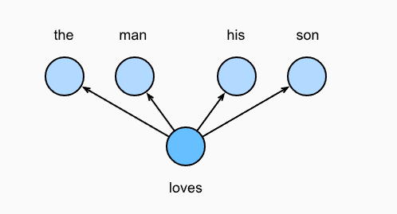
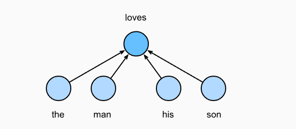

# README

## 1. 多层感知机

多层感知机（Multilayer Perceptron，简称MLP）是一种人工神经网络模型，是深度学习的基本构建块之一。MLP由多个层组成，通常包括一个输入层、一个或多个隐藏层，以及一个输出层。

### 1. 1主要特点

1. **层次结构**：
   - **输入层**：接收原始数据，每个神经元代表输入数据中的一个特征。
   - **隐藏层**：位于输入层和输出层之间，通常包含多个层。每层中的神经元与前一层的所有神经元相连。隐藏层的数量和每层的神经元数量可以根据具体任务进行调整。
   - **输出层**：生成最终的预测结果。输出层的神经元数量取决于任务的类型，例如二分类问题中通常只有一个神经元，而多分类问题中则可能有多个神经元。
2. **激活函数**：
   - 每个隐藏层和输出层的神经元都使用一个激活函数来引入非线性。常见的激活函数包括ReLU（Rectified Linear Unit）、sigmoid、tanh等。激活函数的作用是使模型能够处理非线性问题，从而更好地拟合复杂的数据模式。
3. **前向传播**：
   - 输入数据通过网络层层传递，经过每一层的线性变换和激活函数处理，最终得到输出。这个过程称为前向传播（Forward Propagation）。
4. **反向传播和权重更新**：
   - 在训练过程中，MLP通过反向传播（Backpropagation）算法来调整权重。反向传播计算输出的误差相对于每个权重的梯度，然后使用优化算法（如随机梯度下降）来更新权重，逐步减少误差。
5. **全连接网络**：
   - MLP中的每一层都是全连接层（Fully Connected Layer），这意味着每个神经元都与前一层的所有神经元相连。这种全连接结构使得MLP具有强大的表示能力，但也导致了较高的计算复杂度和容易过拟合的问题。

### 1.2 应用场景

多层感知机可以用于各种任务，包括：

- **分类问题**：如图像分类、文本分类等。
- **回归问题**：预测连续变量，如房价预测。
- **多分类问题**：如手写数字识别，输出多个类中的一个。

尽管MLP在简单任务中表现良好，但由于其固有的结构限制，它在处理高维度、复杂结构化数据（如图像、序列数据）时不如卷积神经网络（CNN）或递归神经网络（RNN）等专门网络高效。

## 2. 论文：A Neural Probabilistic Language Model

本次实验参考A Neural Probabilistic Language Model论文中的模型，论文地址如下:

[   https://www.jmlr.org/papers/volume3/bengio03a/bengio03a.pdf](https://www.jmlr.org/papers/volume3/bengio03a/bengio03a.pdf "   https://www.jmlr.org/papers/volume3/bengio03a/bengio03a.pdf")

《A Neural Probabilistic Language Model》是Yoshua Bengio等人在2003年提出的一种语言模型，旨在克服传统n-gram模型在数据稀疏性方面的局限。该模型的核心思想是通过学习一个连续的词嵌入（word embeddings），将离散的词映射到一个低维的向量空间，从而捕捉单词之间的语义关系。

### 2.1模型结构：

1. **输入层**：将输入序列中的每个词映射到一个固定维度的词向量。
2. **嵌入层（Embedding Layer）**：
   - 词汇表中的每个词都被映射为一个固定维度的向量表示（词嵌入）。这些向量是在训练过程中学习到的，并且是词语的紧凑表示形式。与传统的n-gram模型不同，词嵌入允许模型捕捉词语之间的语义相似性。
3. **隐藏层（Hidden Layer）**：
   - 使用多层感知机（MLP）将输入的词嵌入序列映射为固定长度的向量。在这一层，模型通过权重矩阵对输入向量进行线性变换，并使用非线性激活函数（如tanh）引入非线性特性。这种非线性映射使得模型可以捕捉更复杂的语言模式，而不是简单的线性组合。
4. **输出层（Output Layer）**：
   - 通过Softmax函数计算可能的下一个单词的概率分布。Softmax函数将模型的输出转化为一个概率分布，表示给定前n-1个词时，第n个词为某特定单词的概率。

### 2.2训练过程：

- **目标函数**：模型的训练目标是最大化在训练语料库中所有单词序列的联合概率，这意味着模型要能够准确地预测每个词汇在给定上下文中的出现概率。
- **优化方法**：使用梯度下降法优化模型参数，通过反向传播计算损失函数的梯度，并更新模型的权重，使得模型逐渐收敛，达到较好的预测性能。

### 2.3创新与贡献：

- **词嵌入**：通过引入词嵌入层，模型能够学习词汇之间的语义相似性，从而在低维空间中更好地表示高维词汇数据。
- **参数共享**：词嵌入的参数共享特性使得模型可以高效地利用数据，特别是在处理稀疏数据时，显著减少了模型的参数数量。
- **非线性特性**：通过多层感知机的隐藏层，模型能够捕捉到更复杂的语言模式，超越了传统线性模型的限制。

### 2.4影响与后续发展：

这篇论文为后来的深度学习语言模型奠定了基础。通过引入神经网络来进行语言建模，Bengio等人的工作开创了一条新路径，使得后来的语言模型如Word2Vec、GPT等取得了巨大的成功。此模型不仅有效地解决了n-gram模型中的数据稀疏问题，还为自然语言处理领域的进一步研究提供了重要的理论基础和实践经验。

## 3. 词嵌入

传统的词嵌入分为跳元模型（skip-gram)和连续词袋模型（CBOW），下面将着重介绍这两个模型的思想。&#x20;

### 3.1 跳元模型

#### 3.1.1 概念

跳元模型假设一个词可以用来在文本序列中生成其周围的单词。以文本序列“the”“man”“loves”“his”“son”为例。假设中心词为loves，则通过中心词生成上下文词的概率可表示为：$P( "the", "man","his","son" | "loves")$



由图可知：$P( "the", "man","his","son" | "loves")=P( "the" | "loves" ) \cdot P( "man" | "loves") \cdot P( "his" | "loves" ) \cdot P( "son" | "loves" ).$

#### 3.1.2 实现

在跳元模型中，每个词都有两个d维向量表示，分别用$\mathbf{v}_{i}$和$\mathbf{u}_{i}$表示其用作中心词和上下文词时的两个向量。给定中心词$w_{c}$，生成上下文词的条件概率：

$$
P(w_o \mid w_c) = \frac{\text{exp}(\mathbf{u}_o^\top \mathbf{v}_c)}{ \sum_{i \in \mathcal{V}} \text{exp}(\mathbf{u}_i^\top \mathbf{v}_c)}
$$

#### 3.1.3 训练

使用极大似然函数的思想：最大化给定中心词预测上下文词的概率。同时要注意一个句子可以指定不同的中心词。

$$
\sum_{t=1}^{T} \sum_{-m \leq j \leq m, j \neq 0} \log P\left(w^{(t+j)} \mid w^{(t)}\right).
$$

损失函数就是加上一个负号：

$$
-\sum_{t=1}^{T} \sum_{-m \leq j \leq m, j \neq 0} \log P\left(w^{(t+j)} \mid w^{(t)}\right)
$$

### 3.2 连续词袋模型

#### 3.2.1 概念

和跳元模型相反，连续词袋模型假设中心词是基于其在文本序列中的周围上下文词生成的。例如，在文本序列“the”“man”“loves”“his”“son”中，在“loves”为中心词且上下文窗口为2的情况下，连续词袋模型考虑基于上下文词“the”“man”“him”“son”生成中心词“loves”的条件概率。



#### 3.2.2 原理

在跳元模型中，每个词都有两个d维向量表示，分别用$\mathbf{v}_{i}$和$\mathbf{u}_{i}$表示其用作中心词和上下文词时的两个向量。给定上下文词$w_{o_{1}}, \ldots, w_{o_{2 m}}$，生成中心词$w_{c}$的条件概率为：

$$
    P\left(w_{c} \mid w_{o_{1}}, \ldots, w_{o_{2 m}}\right)=\frac{\exp \left(\frac{1}{2 m} \mathbf{u}_{c}^{\top}\left(\mathbf{v}_{o_{1}}+\ldots,+\mathbf{v}_{o_{2 m}}\right)\right)}{\sum_{i \in \mathcal{V}} \exp \left(\frac{1}{2 m} \mathbf{u}_{i}^{\top}\left(\mathbf{v}_{o_{1}}+\ldots,+\mathbf{v}_{o_{2 m}}\right)\right)}
$$

#### 3.2.3 训练

使用极大似然函数思想：极大化：给定其上下文词的情况下生成所有中心词的概率

$$
\prod_{t=1}^{T} P\left(w^{(t)} \mid w^{(t-m)}, \ldots, w^{(t-1)}, w^{(t+1)}, \ldots, w^{(t+m)}\right)
$$

损失函数即为（在似然函数上加一个log）：

$$
-\sum_{t=1}^{T} \log P\left(w^{(t)} \mid w^{(t-m)}, \ldots, w^{(t-1)}, w^{(t+1)}, \ldots, w^{(t+m)}\right)
$$

## 4. 代码解读

```python
"""
Implements a simple n-gram language model in PyTorch.
Acts as the correctness reference for all the other versions.
"""
import math
import torch
import torch.nn as nn
from torch.nn import functional as F

from common import RNG, StepTimer

# -----------------------------------------------------------------------------
# PyTorch 实现的 MLP n-gram 模型：首先是不使用 nn.Module 的版本

class MLPRaw:
    """
    使用之前的 n 个 token，将它们通过查找表编码，
    将向量连接起来，并通过 MLP 预测下一个 token。

    参考文献：
    Bengio et al. 2003 https://www.jmlr.org/papers/volume3/bengio03a/bengio03a.pdf
    """

    def __init__(self, vocab_size, context_length, embedding_size, hidden_size, rng):
        """
        初始化 MLPRaw 模型的参数。

        参数：
        vocab_size (int): 词汇表的大小
        context_length (int): 上下文长度，即用于预测的 token 数量
        embedding_size (int): 嵌入层的维度
        hidden_size (int): MLP 隐藏层的大小
        rng (RNG): 随机数生成器，用于权重初始化
        """

        v, t, e, h = vocab_size, context_length, embedding_size, hidden_size
        self.embedding_size = embedding_size
        # 初始化词嵌入表
        self.wte = torch.tensor(rng.randn(v * e, mu=0, sigma=1.0)).view(v, e)
        # 初始化第一层全连接层的权重和偏置
        # 这个 scale 用来确保初始化的权重值不会过大或过小。
        scale = 1 / math.sqrt(e * t)
        # weights相当于wx+b函数中的w
        self.fc1_weights = torch.tensor(rng.rand(t * e * h, -scale, scale)).view(h, t * e).T
        # bias相当于wx+b函数中的b
        self.fc1_bias = torch.tensor(rng.rand(h, -scale, scale))
        # 初始化第二层全连接层的权重和偏置
        scale = 1 / math.sqrt(h)
        self.fc2_weights = torch.tensor(rng.rand(v * h, -scale, scale)).view(v, h).T
        self.fc2_bias = torch.tensor(rng.rand(v, -scale, scale))
        # 明确告知 PyTorch 这些是参数，并需要梯度
        for p in self.parameters():
            p.requires_grad = True

    def parameters(self):
        # 返回模型的所有参数
        return [self.wte, self.fc1_weights, self.fc1_bias, self.fc2_weights, self.fc2_bias]

    def __call__(self, idx, targets=None):
        # 调用 forward 方法进行前向传播
        return self.forward(idx, targets)

    def forward(self, idx, targets=None):
        # idx 是输入的 token，(B, T) 形状的整数 tensor
        # targets 是目标 token，(B, ) 形状的整数 tensor
        B, T = idx.size()
        # 前向传播
        # 使用嵌入表编码所有的 token
        emb = self.wte[idx] # (B, T, embedding_size)
        # 将所有嵌入连接在一起
        emb = emb.view(B, -1) # (B, T * embedding_size)
        # 通过 MLP 进行前向传播
        hidden = torch.tanh(emb @ self.fc1_weights + self.fc1_bias)
        logits = hidden @ self.fc2_weights + self.fc2_bias
        # 如果提供了目标，也计算损失
        loss = None
        if targets is not None:
            loss = F.cross_entropy(logits, targets)
        return logits, loss

class MLP(nn.Module):
    """
    MLP n-gram 模型的 PyTorch 实现，使用 nn.Module。

    包含一个嵌入层和一个由两层线性层组成的 MLP。
    """

    def __init__(self, vocab_size, context_length, embedding_size, hidden_size, rng):
        """
        初始化 MLP 模型的参数。

        参数：
        vocab_size (int): 词汇表的大小，即嵌入层的词汇数
        context_length (int): 上下文长度，即用于预测的 token 数量
        embedding_size (int): 嵌入层的维度
        hidden_size (int): MLP 隐藏层的大小
        rng (RNG): 随机数生成器，用于初始化权重
        """
        super().__init__()
        # 初始化 token 嵌入表
        self.wte = nn.Embedding(vocab_size, embedding_size)  # 词汇表大小 x 嵌入维度
        # 初始化 MLP 模型
        self.mlp = nn.Sequential(
            nn.Linear(context_length * embedding_size, hidden_size),  # 第一层线性变换
            nn.Tanh(),  # 激活函数
            nn.Linear(hidden_size, vocab_size)  # 第二层线性变换，输出词汇表大小
        )
        # 使用自定义随机数生成器初始化权重
        self.reinit(rng)

    @torch.no_grad()
    def reinit(self, rng):
        """
        使用自定义随机数生成器初始化模型的权重。

        参数：
        rng (RNG): 随机数生成器，用于初始化权重
        """
        def reinit_tensor_randn(w, mu, sigma):
            """
            用正态分布初始化张量。

            参数：
            w (torch.Tensor): 要初始化的张量
            mu (float): 正态分布的均值
            sigma (float): 正态分布的标准差
            """
            winit = torch.tensor(rng.randn(w.numel(), mu=mu, sigma=sigma))
            w.copy_(winit.view_as(w))

        def reinit_tensor_rand(w, a, b):
            """
            用均匀分布初始化张量。

            参数：
            w (torch.Tensor): 要初始化的张量
            a (float): 均匀分布的下界
            b (float): 均匀分布的上界
            """
            winit = torch.tensor(rng.rand(w.numel(), a=a, b=b))
            w.copy_(winit.view_as(w))

        # 匹配 PyTorch 默认初始化：
        # 嵌入层使用 N(0,1) 初始化
        reinit_tensor_randn(self.wte.weight, mu=0, sigma=1.0)
        # 线性层（W, b）使用 U(-K, K) 初始化，其中 K = 1/sqrt(fan_in)
        scale = (self.mlp[0].in_features)**-0.5
        reinit_tensor_rand(self.mlp[0].weight, -scale, scale)
        reinit_tensor_rand(self.mlp[0].bias, -scale, scale)
        scale = (self.mlp[2].in_features)**-0.5
        reinit_tensor_rand(self.mlp[2].weight, -scale, scale)
        reinit_tensor_rand(self.mlp[2].bias, -scale, scale)

    def forward(self, idx, targets=None):
        """
        执行前向传播。

        参数：
        idx (torch.Tensor): 输入 token 的张量，形状为 (B, T)，其中 B 是批大小，T 是上下文长度
        targets (torch.Tensor, optional): 目标 token 的张量，形状为 (B, )，默认为 None

        返回：
        Tuple[torch.Tensor, Optional[torch.Tensor]]:
            - logits (torch.Tensor): 模型的输出，形状为 (B, V)，其中 V 是词汇表大小
            - loss (torch.Tensor, optional): 如果提供了目标 token，则返回损失，否则为 None
        """
        B, T = idx.size()
        # 获取嵌入表示
        emb = self.wte(idx)  # 形状为 (B, T, embedding_size)
        # 展平嵌入表示
        emb = emb.view(B, -1)  # 形状为 (B, T * embedding_size)
        # 通过 MLP 计算 logits
        logits = self.mlp(emb)
        loss = None
        # 如果提供了目标 token，则计算交叉熵损失
        if targets is not None:
            loss = F.cross_entropy(logits, targets)
        return logits, loss


# -----------------------------------------------------------------------------
# 简单的 DataLoader，用于迭代所有 n-grams

def dataloader(tokens, context_length, batch_size):
    """
    生成用于训练的批量数据。

    参数：
    tokens (list of int): 序列化的 token 列表，表示输入文本
    context_length (int): 上下文长度，即每个输入序列的 token 数量
    batch_size (int): 每个批次的样本数量

    返回：
    Generator[Tuple[torch.Tensor, torch.Tensor]]:
        - inputs (torch.Tensor): 输入张量，形状为 (B, T)，其中 B 是批大小，T 是上下文长度
        - targets (torch.Tensor): 目标张量，形状为 (B, )，其中 B 是批大小
    """

    n = len(tokens)
    inputs, targets = [], []
    pos = 0

    while True:
        # 使用滑动窗口从 token 列表中提取上下文长度 + 1 的窗口
        window = tokens[pos:pos + context_length + 1]
        inputs.append(window[:-1])  # 取上下文部分作为输入
        targets.append(window[-1])  # 取目标 token 作为输出

        # 一旦收集到一个批次，返回该批次
        if len(inputs) == batch_size:
            yield (torch.tensor(inputs), torch.tensor(targets))
            inputs, targets = [], []  # 清空当前批次的输入和目标

        # 移动位置，若到达序列末尾则从头开始
        pos += 1
        if pos + context_length >= n:
            pos = 0


# -----------------------------------------------------------------------------
# 评估函数

@torch.inference_mode()
def eval_split(model, tokens, max_batches=None):
    """
    计算模型在给定 token 上的损失。

    参数：
    model (nn.Module): 要评估的模型
    tokens (list of int): 序列化的 token 列表，表示输入文本
    max_batches (int, optional): 最大批次数。如果为 None，则评估整个数据集；否则，仅评估前 `max_batches` 个批次

    返回：
    float: 平均损失值
    """
    total_loss = 0
    num_batches = len(tokens) // batch_size  # 计算数据集中总的批次数

    # 如果指定了最大批次数，则取最小值以限制评估批次的数量
    if max_batches is not None:
        num_batches = min(num_batches, max_batches)

    # 创建数据迭代器
    data_iter = dataloader(tokens, context_length, batch_size)

    # 遍历批次并计算总损失
    for _ in range(num_batches):
        inputs, targets = next(data_iter)  # 获取一个批次的数据
        logits, loss = model(inputs, targets)  # 计算模型的输出和损失
        total_loss += loss.item()  # 累加损失值

    # 计算平均损失
    mean_loss = total_loss / num_batches
    return mean_loss


# -----------------------------------------------------------------------------
# 从模型中采样

def softmax(logits):
    """
    计算给定 logits 的 softmax 概率分布。

    参数：
    logits (torch.Tensor): 输入的 logits，形状为 (V,) 的一维张量，其中 V 是词汇表大小

    返回：
    torch.Tensor: 计算得到的概率分布，形状为 (V,)
    """
    # 为了数值稳定性，减去 logits 中的最大值
    maxval = torch.max(logits)
    # 计算 exp(logits - maxval)
    exps = torch.exp(logits - maxval)
    # 计算概率分布
    probs = exps / torch.sum(exps)
    return probs

def sample_discrete(probs, coinf):
    """
    从离散概率分布中进行采样。

    参数：
    probs (torch.Tensor): 概率分布，形状为 (V,) 的一维张量，其中 V 是词汇表大小
    coinf (float): 介于 0 和 1 之间的浮点数，用作随机数

    返回：
    int: 采样得到的离散值的索引
    """
    # 累积分布函数
    cdf = 0.0
    # 遍历每个概率值
    for i, prob in enumerate(probs):
        cdf += prob
        # 如果随机数小于当前累积概率，则返回当前索引
        if coinf < cdf:
            return i
    # 处理舍入误差，返回最后一个索引
    return len(probs) - 1


# -----------------------------------------------------------------------------
# 开始训练！

# "训练" Tokenizer，使其能够在字符和令牌之间进行映射
train_text = open('../datasets/data/train.txt', 'r').read()
# 确保训练文本只包含换行符或小写字母
assert all(c == '\n' or ('a' <= c <= 'z') for c in train_text)
# 获取训练文本中的所有唯一字符，并按字母排序
uchars = sorted(list(set(train_text)))
vocab_size = len(uchars)  # 词汇表大小
print(vocab_size)
# 创建字符到令牌的映射
char_to_token = {c: i for i, c in enumerate(uchars)}
# 创建令牌到字符的映射
token_to_char = {i: c for i, c in enumerate(uchars)}
# 将换行符指定为结束标记 (EOT)
EOT_TOKEN = char_to_token['\n']
# 将所有文本预处理为令牌
test_tokens = [char_to_token[c] for c in open('../datasets/data/test.txt', 'r').read()]
val_tokens = [char_to_token[c] for c in open('../datasets/data/val.txt', 'r').read()]
train_tokens = [char_to_token[c] for c in open('../datasets/data/train.txt', 'r').read()]

# 创建模型
context_length = 3  # 如果用 3 个令牌预测第 4 个令牌，这是一个 4-gram 模型
embedding_size = 48  # 嵌入向量的维度
hidden_size = 512  # 隐藏层的大小
init_rng = RNG(1337)  # 初始化随机数生成器
# 两个模型类都会产生完全相同的结果。一个使用 nn.Module，另一个不使用
model = MLPRaw(vocab_size, context_length, embedding_size, hidden_size, init_rng)
# model = MLP(vocab_size, context_length, embedding_size, hidden_size, init_rng)

# 创建优化器
learning_rate = 7e-4  # 学习率
optimizer = torch.optim.AdamW(model.parameters(), lr=learning_rate, weight_decay=1e-4)

# 训练循环
timer = StepTimer()  # 用于记录时间的计时器
batch_size = 128  # 批次大小
num_steps = 50000  # 训练步数
print(f'num_steps {num_steps}, num_epochs {num_steps * batch_size / len(train_tokens):.2f}')
train_data_iter = dataloader(train_tokens, context_length, batch_size)

for step in range(num_steps):
    # 余弦学习率调度，从最大学习率到 0
    lr = learning_rate * 0.5 * (1 + math.cos(math.pi * step / num_steps))
    for param_group in optimizer.param_groups:
        param_group['lr'] = lr
    # 每隔一段时间评估一次验证损失
    last_step = step == num_steps - 1
    if step % 200 == 0 or last_step:
        train_loss = eval_split(model, train_tokens, max_batches=20)
        val_loss = eval_split(model, val_tokens)
        print(f'step {step:6d} | train_loss {train_loss:.6f} | val_loss {val_loss:.6f} | lr {lr:e} | time/step {timer.get_dt()*1000:.4f}ms')

    # 训练步骤
    with timer:
        # 获取下一个批次的训练数据
        inputs, targets = next(train_data_iter)
        # 前向传播（计算损失）
        logits, loss = model(inputs, targets)
        # 反向传播（计算梯度）
        loss.backward()
        # 更新优化器（更新参数）
        optimizer.step()
        optimizer.zero_grad()

# 模型推断
# 硬编码一个提示文本，以便继续生成文本
sample_rng = RNG(42)  # 采样用的随机数生成器
prompt = "\nrichard"  # 提示文本
context = [char_to_token[c] for c in prompt]  # 将提示文本转换为令牌
assert len(context) >= context_length
context = context[-context_length:]  # 裁剪到上下文长度
print(prompt, end='', flush=True)
# 现在生成接下来的 200 个令牌
with torch.inference_mode():
    for _ in range(200):
        # 取最后的 context_length 个令牌，预测下一个令牌
        context_tensor = torch.tensor(context).unsqueeze(0)  # (1, T)
        logits, _ = model(context_tensor)  # (1, V)
        probs = softmax(logits[0])  # (V, )
        coinf = sample_rng.random()  # "硬币抛掷"，范围在 [0, 1) 之间的 float32
        next_token = sample_discrete(probs, coinf)  # 从离散分布中采样
        context = context[1:] + [next_token]  # 更新令牌上下文
        print(token_to_char[next_token], end='', flush=True)
print()  # 换行

# 最后报告测试损失
test_loss = eval_split(model, test_tokens)
print(f'test_loss {test_loss}')


```

## 5. 运行结果

```text
D:\miniconda\envs\deeplearning\python.exe D:\CODE\python\llm101n-zh\llm101n-zh\code\03_mlp\mlp_pytorch.py 
27
num_steps 50000, num_epochs 29.94
step      0 | train_loss 3.279659 | val_loss 3.287299 | lr 7.000000e-04 | time/step 0.0000ms
step    200 | train_loss 2.336543 | val_loss 2.378927 | lr 6.999724e-04 | time/step 2.4157ms
step    400 | train_loss 2.309189 | val_loss 2.337502 | lr 6.998895e-04 | time/step 2.6641ms
step    600 | train_loss 2.295241 | val_loss 2.319203 | lr 6.997513e-04 | time/step 2.5114ms
step    800 | train_loss 2.278947 | val_loss 2.299441 | lr 6.995579e-04 | time/step 2.4312ms
step   1000 | train_loss 2.255725 | val_loss 2.271110 | lr 6.993094e-04 | time/step 2.4704ms
step   1200 | train_loss 2.241693 | val_loss 2.260402 | lr 6.990056e-04 | time/step 2.3629ms
step   1400 | train_loss 2.237061 | val_loss 2.254497 | lr 6.986468e-04 | time/step 2.4022ms
step   1600 | train_loss 2.222607 | val_loss 2.232820 | lr 6.982329e-04 | time/step 2.3330ms
step   1800 | train_loss 2.187854 | val_loss 2.233038 | lr 6.977640e-04 | time/step 2.4825ms
step   2000 | train_loss 2.191602 | val_loss 2.223437 | lr 6.972401e-04 | time/step 2.5269ms
step   2200 | train_loss 2.179313 | val_loss 2.210995 | lr 6.966615e-04 | time/step 2.3046ms
step   2400 | train_loss 2.181637 | val_loss 2.212414 | lr 6.960281e-04 | time/step 2.5447ms
step   2600 | train_loss 2.183881 | val_loss 2.202135 | lr 6.953401e-04 | time/step 2.5262ms
step   2800 | train_loss 2.166848 | val_loss 2.196007 | lr 6.945975e-04 | time/step 2.3071ms
step   3000 | train_loss 2.172904 | val_loss 2.198627 | lr 6.938005e-04 | time/step 2.3645ms
step   3200 | train_loss 2.180481 | val_loss 2.196605 | lr 6.929493e-04 | time/step 2.2966ms
step   3400 | train_loss 2.092246 | val_loss 2.185255 | lr 6.920438e-04 | time/step 2.3975ms
step   3600 | train_loss 2.133376 | val_loss 2.172838 | lr 6.910844e-04 | time/step 2.4839ms
step   3800 | train_loss 2.137729 | val_loss 2.181178 | lr 6.900711e-04 | time/step 2.5172ms
step   4000 | train_loss 2.133201 | val_loss 2.170799 | lr 6.890041e-04 | time/step 2.3930ms
step   4200 | train_loss 2.130555 | val_loss 2.167631 | lr 6.878836e-04 | time/step 2.4120ms
step   4400 | train_loss 2.129088 | val_loss 2.160738 | lr 6.867097e-04 | time/step 2.5549ms
step   4600 | train_loss 2.130790 | val_loss 2.165930 | lr 6.854826e-04 | time/step 2.4577ms
step   4800 | train_loss 2.129641 | val_loss 2.169152 | lr 6.842026e-04 | time/step 2.6507ms
step   5000 | train_loss 2.128107 | val_loss 2.152321 | lr 6.828698e-04 | time/step 2.4455ms
step   5200 | train_loss 2.087977 | val_loss 2.161084 | lr 6.814844e-04 | time/step 2.5068ms
step   5400 | train_loss 2.085144 | val_loss 2.144656 | lr 6.800467e-04 | time/step 2.5528ms
step   5600 | train_loss 2.088087 | val_loss 2.151279 | lr 6.785569e-04 | time/step 2.4263ms
step   5800 | train_loss 2.113875 | val_loss 2.147810 | lr 6.770151e-04 | time/step 2.4925ms
step   6000 | train_loss 2.101124 | val_loss 2.137313 | lr 6.754218e-04 | time/step 2.4097ms
step   6200 | train_loss 2.099495 | val_loss 2.138211 | lr 6.737770e-04 | time/step 2.3242ms
step   6400 | train_loss 2.109471 | val_loss 2.142903 | lr 6.720811e-04 | time/step 2.4760ms
step   6600 | train_loss 2.107538 | val_loss 2.144105 | lr 6.703344e-04 | time/step 2.4251ms
step   6800 | train_loss 2.053916 | val_loss 2.141246 | lr 6.685371e-04 | time/step 2.6248ms
step   7000 | train_loss 2.068361 | val_loss 2.134190 | lr 6.666895e-04 | time/step 3.2045ms
step   7200 | train_loss 2.072390 | val_loss 2.128223 | lr 6.647918e-04 | time/step 3.2048ms
step   7400 | train_loss 2.078719 | val_loss 2.129892 | lr 6.628445e-04 | time/step 3.1719ms
step   7600 | train_loss 2.095685 | val_loss 2.133650 | lr 6.608478e-04 | time/step 3.1212ms
step   7800 | train_loss 2.078515 | val_loss 2.135924 | lr 6.588019e-04 | time/step 2.9835ms
step   8000 | train_loss 2.088210 | val_loss 2.133506 | lr 6.567073e-04 | time/step 3.0872ms
step   8200 | train_loss 2.088678 | val_loss 2.132539 | lr 6.545643e-04 | time/step 3.1035ms
step   8400 | train_loss 1.988273 | val_loss 2.128420 | lr 6.523732e-04 | time/step 3.0590ms
step   8600 | train_loss 2.047370 | val_loss 2.122166 | lr 6.501343e-04 | time/step 3.1409ms
step   8800 | train_loss 2.055583 | val_loss 2.125711 | lr 6.478481e-04 | time/step 3.4949ms
step   9000 | train_loss 2.056009 | val_loss 2.119600 | lr 6.455148e-04 | time/step 3.0491ms
step   9200 | train_loss 2.067875 | val_loss 2.126183 | lr 6.431348e-04 | time/step 3.1638ms
step   9400 | train_loss 2.061782 | val_loss 2.116462 | lr 6.407086e-04 | time/step 3.1954ms
step   9600 | train_loss 2.065454 | val_loss 2.122595 | lr 6.382364e-04 | time/step 3.2524ms
step   9800 | train_loss 2.063738 | val_loss 2.123213 | lr 6.357187e-04 | time/step 3.2595ms
step  10000 | train_loss 2.071860 | val_loss 2.112800 | lr 6.331559e-04 | time/step 3.1342ms
step  10200 | train_loss 2.023343 | val_loss 2.119037 | lr 6.305484e-04 | time/step 3.2292ms
step  10400 | train_loss 2.038777 | val_loss 2.115989 | lr 6.278966e-04 | time/step 3.0775ms
step  10600 | train_loss 2.038420 | val_loss 2.114813 | lr 6.252010e-04 | time/step 3.2414ms
step  10800 | train_loss 2.058746 | val_loss 2.115921 | lr 6.224618e-04 | time/step 3.2403ms
step  11000 | train_loss 2.051579 | val_loss 2.112374 | lr 6.196796e-04 | time/step 3.1522ms
step  11200 | train_loss 2.050129 | val_loss 2.117528 | lr 6.168549e-04 | time/step 3.1351ms
step  11400 | train_loss 2.051814 | val_loss 2.112818 | lr 6.139880e-04 | time/step 2.9461ms
step  11600 | train_loss 2.062645 | val_loss 2.119502 | lr 6.110794e-04 | time/step 3.2195ms
step  11800 | train_loss 2.001326 | val_loss 2.112802 | lr 6.081296e-04 | time/step 3.2588ms
step  12000 | train_loss 2.018694 | val_loss 2.110972 | lr 6.051390e-04 | time/step 2.9948ms
step  12200 | train_loss 2.031342 | val_loss 2.104963 | lr 6.021082e-04 | time/step 3.1009ms
step  12400 | train_loss 2.037412 | val_loss 2.105250 | lr 5.990375e-04 | time/step 3.0224ms
step  12600 | train_loss 2.044755 | val_loss 2.106163 | lr 5.959275e-04 | time/step 3.3082ms
step  12800 | train_loss 2.045430 | val_loss 2.112212 | lr 5.927787e-04 | time/step 3.3445ms
step  13000 | train_loss 2.046104 | val_loss 2.108280 | lr 5.895915e-04 | time/step 3.0577ms
step  13200 | train_loss 2.043263 | val_loss 2.104255 | lr 5.863665e-04 | time/step 3.2874ms
step  13400 | train_loss 1.937972 | val_loss 2.105547 | lr 5.831042e-04 | time/step 3.0082ms
step  13600 | train_loss 2.002973 | val_loss 2.100291 | lr 5.798050e-04 | time/step 3.4123ms
step  13800 | train_loss 2.015386 | val_loss 2.109810 | lr 5.764696e-04 | time/step 3.4989ms
step  14000 | train_loss 2.013266 | val_loss 2.099025 | lr 5.730984e-04 | time/step 3.4368ms
step  14200 | train_loss 2.032131 | val_loss 2.108549 | lr 5.696920e-04 | time/step 3.3390ms
step  14400 | train_loss 2.035161 | val_loss 2.099916 | lr 5.662509e-04 | time/step 3.0737ms
step  14600 | train_loss 2.029074 | val_loss 2.105777 | lr 5.627756e-04 | time/step 3.0917ms
step  14800 | train_loss 2.025897 | val_loss 2.104032 | lr 5.592667e-04 | time/step 3.0919ms
step  15000 | train_loss 2.035654 | val_loss 2.099011 | lr 5.557248e-04 | time/step 3.0954ms
step  15200 | train_loss 1.985262 | val_loss 2.095513 | lr 5.521504e-04 | time/step 3.1619ms
step  15400 | train_loss 2.004923 | val_loss 2.095940 | lr 5.485441e-04 | time/step 3.1833ms
step  15600 | train_loss 2.013278 | val_loss 2.100231 | lr 5.449065e-04 | time/step 3.1091ms
step  15800 | train_loss 2.020367 | val_loss 2.096653 | lr 5.412380e-04 | time/step 3.2122ms
step  16000 | train_loss 2.022282 | val_loss 2.100062 | lr 5.375394e-04 | time/step 3.0372ms
step  16200 | train_loss 2.017049 | val_loss 2.099442 | lr 5.338111e-04 | time/step 3.1173ms
step  16400 | train_loss 2.023190 | val_loss 2.098063 | lr 5.300538e-04 | time/step 3.3075ms
step  16600 | train_loss 2.034158 | val_loss 2.100991 | lr 5.262681e-04 | time/step 3.1589ms
step  16800 | train_loss 1.970466 | val_loss 2.095067 | lr 5.224546e-04 | time/step 3.5711ms
step  17000 | train_loss 1.992329 | val_loss 2.093068 | lr 5.186138e-04 | time/step 3.5370ms
step  17200 | train_loss 1.999539 | val_loss 2.092010 | lr 5.147464e-04 | time/step 3.4929ms
step  17400 | train_loss 1.999587 | val_loss 2.089606 | lr 5.108530e-04 | time/step 4.0944ms
step  17600 | train_loss 2.011424 | val_loss 2.092818 | lr 5.069341e-04 | time/step 3.3153ms
step  17800 | train_loss 2.019188 | val_loss 2.096201 | lr 5.029905e-04 | time/step 3.0997ms
step  18000 | train_loss 2.016532 | val_loss 2.094081 | lr 4.990228e-04 | time/step 3.0818ms
step  18200 | train_loss 2.015153 | val_loss 2.094477 | lr 4.950315e-04 | time/step 3.0877ms
step  18400 | train_loss 1.917879 | val_loss 2.090374 | lr 4.910173e-04 | time/step 3.0984ms
step  18600 | train_loss 1.975859 | val_loss 2.090875 | lr 4.869808e-04 | time/step 3.0292ms
step  18800 | train_loss 1.986050 | val_loss 2.094827 | lr 4.829227e-04 | time/step 3.1462ms
step  19000 | train_loss 1.991276 | val_loss 2.088224 | lr 4.788436e-04 | time/step 3.3264ms
step  19200 | train_loss 2.004716 | val_loss 2.095463 | lr 4.747442e-04 | time/step 3.1593ms
step  19400 | train_loss 2.003702 | val_loss 2.082662 | lr 4.706250e-04 | time/step 3.0781ms
step  19600 | train_loss 2.006618 | val_loss 2.091374 | lr 4.664868e-04 | time/step 3.1024ms
step  19800 | train_loss 1.999196 | val_loss 2.091960 | lr 4.623303e-04 | time/step 3.4386ms
step  20000 | train_loss 2.017428 | val_loss 2.089625 | lr 4.581559e-04 | time/step 3.0796ms
step  20200 | train_loss 1.965733 | val_loss 2.090522 | lr 4.539646e-04 | time/step 3.1112ms
step  20400 | train_loss 1.982576 | val_loss 2.088493 | lr 4.497567e-04 | time/step 3.0787ms
step  20600 | train_loss 1.985428 | val_loss 2.085681 | lr 4.455332e-04 | time/step 2.5765ms
step  20800 | train_loss 1.995237 | val_loss 2.088180 | lr 4.412945e-04 | time/step 2.2892ms
step  21000 | train_loss 2.001384 | val_loss 2.089859 | lr 4.370415e-04 | time/step 2.4211ms
step  21200 | train_loss 2.000331 | val_loss 2.086477 | lr 4.327746e-04 | time/step 2.3426ms
step  21400 | train_loss 2.002531 | val_loss 2.085916 | lr 4.284948e-04 | time/step 2.5917ms
step  21600 | train_loss 2.013844 | val_loss 2.088675 | lr 4.242025e-04 | time/step 2.6808ms
step  21800 | train_loss 1.945865 | val_loss 2.084332 | lr 4.198985e-04 | time/step 2.4668ms
step  22000 | train_loss 1.971062 | val_loss 2.080257 | lr 4.155835e-04 | time/step 2.5216ms
step  22200 | train_loss 1.977825 | val_loss 2.082408 | lr 4.112581e-04 | time/step 2.3635ms
step  22400 | train_loss 1.978336 | val_loss 2.084998 | lr 4.069230e-04 | time/step 2.3715ms
step  22600 | train_loss 1.992654 | val_loss 2.084111 | lr 4.025790e-04 | time/step 2.6125ms
step  22800 | train_loss 1.994532 | val_loss 2.081145 | lr 3.982266e-04 | time/step 2.4512ms
step  23000 | train_loss 1.998343 | val_loss 2.085706 | lr 3.938666e-04 | time/step 2.2430ms
step  23200 | train_loss 1.995852 | val_loss 2.082469 | lr 3.894997e-04 | time/step 2.4629ms
step  23400 | train_loss 1.950453 | val_loss 2.081750 | lr 3.851266e-04 | time/step 2.4066ms
step  23600 | train_loss 1.958095 | val_loss 2.084689 | lr 3.807479e-04 | time/step 2.3869ms
step  23800 | train_loss 1.971544 | val_loss 2.084795 | lr 3.763644e-04 | time/step 2.4804ms
step  24000 | train_loss 1.978640 | val_loss 2.080949 | lr 3.719767e-04 | time/step 2.4464ms
step  24200 | train_loss 1.985781 | val_loss 2.084310 | lr 3.675855e-04 | time/step 2.3418ms
step  24400 | train_loss 1.983058 | val_loss 2.077385 | lr 3.631916e-04 | time/step 2.0402ms
step  24600 | train_loss 1.987828 | val_loss 2.080085 | lr 3.587955e-04 | time/step 2.4282ms
step  24800 | train_loss 1.986618 | val_loss 2.083322 | lr 3.543981e-04 | time/step 2.5127ms
step  25000 | train_loss 1.998152 | val_loss 2.081098 | lr 3.500000e-04 | time/step 2.5365ms
step  25200 | train_loss 1.951110 | val_loss 2.080484 | lr 3.456019e-04 | time/step 2.2233ms
step  25400 | train_loss 1.963980 | val_loss 2.079425 | lr 3.412045e-04 | time/step 2.3556ms
step  25600 | train_loss 1.966854 | val_loss 2.077429 | lr 3.368084e-04 | time/step 2.2775ms
step  25800 | train_loss 1.973626 | val_loss 2.079161 | lr 3.324145e-04 | time/step 2.3831ms
step  26000 | train_loss 1.985499 | val_loss 2.076796 | lr 3.280233e-04 | time/step 2.6593ms
step  26200 | train_loss 1.983951 | val_loss 2.076514 | lr 3.236356e-04 | time/step 2.6376ms
step  26400 | train_loss 1.987623 | val_loss 2.078433 | lr 3.192521e-04 | time/step 2.6383ms
step  26600 | train_loss 1.994355 | val_loss 2.079576 | lr 3.148734e-04 | time/step 2.5946ms
step  26800 | train_loss 1.931176 | val_loss 2.076144 | lr 3.105003e-04 | time/step 2.2521ms
step  27000 | train_loss 1.958225 | val_loss 2.073892 | lr 3.061334e-04 | time/step 2.3591ms
step  27200 | train_loss 1.963761 | val_loss 2.077410 | lr 3.017734e-04 | time/step 2.5159ms
step  27400 | train_loss 1.964835 | val_loss 2.075768 | lr 2.974210e-04 | time/step 2.7037ms
step  27600 | train_loss 1.976003 | val_loss 2.075004 | lr 2.930770e-04 | time/step 2.3057ms
step  27800 | train_loss 1.978064 | val_loss 2.071611 | lr 2.887419e-04 | time/step 2.3075ms
step  28000 | train_loss 1.980835 | val_loss 2.077911 | lr 2.844165e-04 | time/step 2.2423ms
step  28200 | train_loss 1.981695 | val_loss 2.077645 | lr 2.801015e-04 | time/step 2.3311ms
step  28400 | train_loss 1.975422 | val_loss 2.071775 | lr 2.757975e-04 | time/step 2.4368ms
step  28600 | train_loss 1.945796 | val_loss 2.075951 | lr 2.715052e-04 | time/step 2.4939ms
step  28800 | train_loss 1.955442 | val_loss 2.072336 | lr 2.672254e-04 | time/step 2.2905ms
step  29000 | train_loss 1.961741 | val_loss 2.073442 | lr 2.629585e-04 | time/step 2.2730ms
step  29200 | train_loss 1.971964 | val_loss 2.074028 | lr 2.587055e-04 | time/step 2.3050ms
step  29400 | train_loss 1.967906 | val_loss 2.068763 | lr 2.544668e-04 | time/step 2.3835ms
step  29600 | train_loss 1.970789 | val_loss 2.071628 | lr 2.502433e-04 | time/step 2.4331ms
step  29800 | train_loss 1.972782 | val_loss 2.071299 | lr 2.460354e-04 | time/step 2.4643ms
step  30000 | train_loss 1.977069 | val_loss 2.071077 | lr 2.418441e-04 | time/step 2.5612ms
step  30200 | train_loss 1.943472 | val_loss 2.071836 | lr 2.376697e-04 | time/step 2.1256ms
step  30400 | train_loss 1.953084 | val_loss 2.070466 | lr 2.335132e-04 | time/step 2.4832ms
step  30600 | train_loss 1.955762 | val_loss 2.069350 | lr 2.293750e-04 | time/step 2.3827ms
step  30800 | train_loss 1.959492 | val_loss 2.070685 | lr 2.252558e-04 | time/step 2.3765ms
step  31000 | train_loss 1.970966 | val_loss 2.069463 | lr 2.211564e-04 | time/step 2.5138ms
step  31200 | train_loss 1.966446 | val_loss 2.069696 | lr 2.170773e-04 | time/step 2.2889ms
step  31400 | train_loss 1.971238 | val_loss 2.071291 | lr 2.130192e-04 | time/step 2.4552ms
step  31600 | train_loss 1.973811 | val_loss 2.070402 | lr 2.089827e-04 | time/step 2.3235ms
step  31800 | train_loss 1.924030 | val_loss 2.069058 | lr 2.049685e-04 | time/step 2.3256ms
step  32000 | train_loss 1.948940 | val_loss 2.068905 | lr 2.009772e-04 | time/step 2.4229ms
step  32200 | train_loss 1.953043 | val_loss 2.070145 | lr 1.970095e-04 | time/step 2.5136ms
step  32400 | train_loss 1.956595 | val_loss 2.068842 | lr 1.930659e-04 | time/step 2.4777ms
step  32600 | train_loss 1.963284 | val_loss 2.069024 | lr 1.891470e-04 | time/step 2.3368ms
step  32800 | train_loss 1.963253 | val_loss 2.065016 | lr 1.852536e-04 | time/step 2.3716ms
step  33000 | train_loss 1.963626 | val_loss 2.069839 | lr 1.813862e-04 | time/step 2.2743ms
step  33200 | train_loss 1.967109 | val_loss 2.071737 | lr 1.775454e-04 | time/step 2.3644ms
step  33400 | train_loss 1.966963 | val_loss 2.066218 | lr 1.737319e-04 | time/step 2.3886ms
step  33600 | train_loss 1.941377 | val_loss 2.068786 | lr 1.699462e-04 | time/step 2.3708ms
step  33800 | train_loss 1.947303 | val_loss 2.066618 | lr 1.661889e-04 | time/step 2.5141ms
step  34000 | train_loss 1.949800 | val_loss 2.067247 | lr 1.624606e-04 | time/step 2.4572ms
step  34200 | train_loss 1.958255 | val_loss 2.067038 | lr 1.587620e-04 | time/step 2.4614ms
step  34400 | train_loss 1.957463 | val_loss 2.063993 | lr 1.550935e-04 | time/step 2.3998ms
step  34600 | train_loss 1.956838 | val_loss 2.065945 | lr 1.514559e-04 | time/step 2.3235ms
step  34800 | train_loss 1.961974 | val_loss 2.066718 | lr 1.478496e-04 | time/step 2.3515ms
step  35000 | train_loss 1.963535 | val_loss 2.066457 | lr 1.442752e-04 | time/step 2.3815ms
step  35200 | train_loss 1.939560 | val_loss 2.065790 | lr 1.407333e-04 | time/step 2.3539ms
step  35400 | train_loss 1.945412 | val_loss 2.065393 | lr 1.372244e-04 | time/step 2.4790ms
step  35600 | train_loss 1.949680 | val_loss 2.064837 | lr 1.337491e-04 | time/step 2.3938ms
step  35800 | train_loss 1.950682 | val_loss 2.065026 | lr 1.303080e-04 | time/step 2.4920ms
step  36000 | train_loss 1.956114 | val_loss 2.063034 | lr 1.269016e-04 | time/step 2.3461ms
step  36200 | train_loss 1.954846 | val_loss 2.065559 | lr 1.235304e-04 | time/step 2.4492ms
step  36400 | train_loss 1.956827 | val_loss 2.064858 | lr 1.201950e-04 | time/step 2.3465ms
step  36600 | train_loss 1.956839 | val_loss 2.063514 | lr 1.168958e-04 | time/step 2.5499ms
step  36800 | train_loss 1.927201 | val_loss 2.063991 | lr 1.136335e-04 | time/step 2.3515ms
step  37000 | train_loss 1.941453 | val_loss 2.063348 | lr 1.104085e-04 | time/step 2.3578ms
step  37200 | train_loss 1.945560 | val_loss 2.064868 | lr 1.072213e-04 | time/step 2.3283ms
step  37400 | train_loss 1.948017 | val_loss 2.063539 | lr 1.040725e-04 | time/step 2.5137ms
step  37600 | train_loss 1.951932 | val_loss 2.064502 | lr 1.009625e-04 | time/step 2.4059ms
step  37800 | train_loss 1.951925 | val_loss 2.060992 | lr 9.789184e-05 | time/step 2.4734ms
step  38000 | train_loss 1.950971 | val_loss 2.062565 | lr 9.486098e-05 | time/step 2.3474ms
step  38200 | train_loss 1.954319 | val_loss 2.064945 | lr 9.187041e-05 | time/step 2.4208ms
step  38400 | train_loss 1.955727 | val_loss 2.062225 | lr 8.892060e-05 | time/step 2.4887ms
step  38600 | train_loss 1.940198 | val_loss 2.062865 | lr 8.601202e-05 | time/step 2.4468ms
step  38800 | train_loss 1.942728 | val_loss 2.062210 | lr 8.314512e-05 | time/step 2.3764ms
step  39000 | train_loss 1.944758 | val_loss 2.062770 | lr 8.032037e-05 | time/step 2.3598ms
step  39200 | train_loss 1.947867 | val_loss 2.062431 | lr 7.753819e-05 | time/step 2.4023ms
step  39400 | train_loss 1.949417 | val_loss 2.061035 | lr 7.479905e-05 | time/step 2.3405ms
step  39600 | train_loss 1.948145 | val_loss 2.061384 | lr 7.210336e-05 | time/step 2.5396ms
step  39800 | train_loss 1.951568 | val_loss 2.062551 | lr 6.945156e-05 | time/step 2.3813ms
step  40000 | train_loss 1.953806 | val_loss 2.062355 | lr 6.684405e-05 | time/step 2.3903ms
step  40200 | train_loss 1.937704 | val_loss 2.061153 | lr 6.428126e-05 | time/step 2.3504ms
step  40400 | train_loss 1.942035 | val_loss 2.061602 | lr 6.176359e-05 | time/step 2.5505ms
step  40600 | train_loss 1.944405 | val_loss 2.061182 | lr 5.929144e-05 | time/step 2.3877ms
step  40800 | train_loss 1.945066 | val_loss 2.061284 | lr 5.686519e-05 | time/step 2.5099ms
step  41000 | train_loss 1.947064 | val_loss 2.060618 | lr 5.448523e-05 | time/step 2.5433ms
step  41200 | train_loss 1.947461 | val_loss 2.060217 | lr 5.215193e-05 | time/step 2.4920ms
step  41400 | train_loss 1.947321 | val_loss 2.060804 | lr 4.986567e-05 | time/step 2.3731ms
step  41600 | train_loss 1.949231 | val_loss 2.060821 | lr 4.762680e-05 | time/step 2.5944ms
step  41800 | train_loss 1.935659 | val_loss 2.060463 | lr 4.543569e-05 | time/step 2.5679ms
step  42000 | train_loss 1.940123 | val_loss 2.060164 | lr 4.329266e-05 | time/step 2.3617ms
step  42200 | train_loss 1.941808 | val_loss 2.060913 | lr 4.119807e-05 | time/step 2.3674ms
step  42400 | train_loss 1.943392 | val_loss 2.060463 | lr 3.915224e-05 | time/step 2.3697ms
step  42600 | train_loss 1.944677 | val_loss 2.060621 | lr 3.715550e-05 | time/step 2.3756ms
step  42800 | train_loss 1.945661 | val_loss 2.059092 | lr 3.520816e-05 | time/step 2.4105ms
step  43000 | train_loss 1.944841 | val_loss 2.059459 | lr 3.331053e-05 | time/step 2.3778ms
step  43200 | train_loss 1.946081 | val_loss 2.060442 | lr 3.146291e-05 | time/step 2.4586ms
step  43400 | train_loss 1.948093 | val_loss 2.059924 | lr 2.966559e-05 | time/step 2.4765ms
step  43600 | train_loss 1.940548 | val_loss 2.059497 | lr 2.791885e-05 | time/step 2.4252ms
step  43800 | train_loss 1.941782 | val_loss 2.059728 | lr 2.622298e-05 | time/step 2.4411ms
step  44000 | train_loss 1.942521 | val_loss 2.059906 | lr 2.457823e-05 | time/step 2.4288ms
step  44200 | train_loss 1.943172 | val_loss 2.059939 | lr 2.298487e-05 | time/step 2.4162ms
step  44400 | train_loss 1.944201 | val_loss 2.059392 | lr 2.144315e-05 | time/step 2.4044ms
step  44600 | train_loss 1.944054 | val_loss 2.059244 | lr 1.995331e-05 | time/step 2.4492ms
step  44800 | train_loss 1.944537 | val_loss 2.059517 | lr 1.851559e-05 | time/step 2.4367ms
step  45000 | train_loss 1.945942 | val_loss 2.059588 | lr 1.713022e-05 | time/step 2.6107ms
step  45200 | train_loss 1.940979 | val_loss 2.059320 | lr 1.579741e-05 | time/step 2.3480ms
step  45400 | train_loss 1.942002 | val_loss 2.059344 | lr 1.451737e-05 | time/step 2.5695ms
step  45600 | train_loss 1.942186 | val_loss 2.059414 | lr 1.329031e-05 | time/step 2.4676ms
step  45800 | train_loss 1.942712 | val_loss 2.059510 | lr 1.211643e-05 | time/step 2.1868ms
step  46000 | train_loss 1.942844 | val_loss 2.059287 | lr 1.099589e-05 | time/step 2.4324ms
step  46200 | train_loss 1.943501 | val_loss 2.058982 | lr 9.928893e-06 | time/step 2.4203ms
step  46400 | train_loss 1.943163 | val_loss 2.059093 | lr 8.915595e-06 | time/step 2.2743ms
step  46600 | train_loss 1.943755 | val_loss 2.059271 | lr 7.956157e-06 | time/step 2.4218ms
step  46800 | train_loss 1.942102 | val_loss 2.059199 | lr 7.050732e-06 | time/step 2.3360ms
step  47000 | train_loss 1.942243 | val_loss 2.059148 | lr 6.199462e-06 | time/step 2.4334ms
step  47200 | train_loss 1.942369 | val_loss 2.059233 | lr 5.402483e-06 | time/step 2.3578ms
step  47400 | train_loss 1.942551 | val_loss 2.059227 | lr 4.659920e-06 | time/step 2.2923ms
step  47600 | train_loss 1.942649 | val_loss 2.059244 | lr 3.971889e-06 | time/step 2.4372ms
step  47800 | train_loss 1.942804 | val_loss 2.059081 | lr 3.338501e-06 | time/step 2.3692ms
step  48000 | train_loss 1.942776 | val_loss 2.059080 | lr 2.759855e-06 | time/step 2.3810ms
step  48200 | train_loss 1.942822 | val_loss 2.059132 | lr 2.236041e-06 | time/step 2.2894ms
step  48400 | train_loss 1.943078 | val_loss 2.059125 | lr 1.767144e-06 | time/step 2.3470ms
step  48600 | train_loss 1.942632 | val_loss 2.059112 | lr 1.353237e-06 | time/step 2.3026ms
step  48800 | train_loss 1.942668 | val_loss 2.059121 | lr 9.943849e-07 | time/step 2.5116ms
step  49000 | train_loss 1.942676 | val_loss 2.059127 | lr 6.906451e-07 | time/step 2.4157ms
step  49200 | train_loss 1.942695 | val_loss 2.059135 | lr 4.420652e-07 | time/step 2.6258ms
step  49400 | train_loss 1.942705 | val_loss 2.059127 | lr 2.486846e-07 | time/step 2.3220ms
step  49600 | train_loss 1.942710 | val_loss 2.059125 | lr 1.105338e-07 | time/step 2.3691ms
step  49800 | train_loss 1.942708 | val_loss 2.059125 | lr 2.763453e-08 | time/step 2.3739ms
step  49999 | train_loss 1.942708 | val_loss 2.059125 | lr 6.908723e-13 | time/step 2.6887ms

richard
roydhan
makye
makyiah
eline
rah
yiridhika
truby
xyleine
ralea
gyo
alastianand
caia
latum
brohanie
royalaiannie
elannah
obi
nyel
micharveniyah
mala
omi
nemetrie
reah
jhoe
natal
sel
olimso
kaverek
tie

test_loss 2.0579814016819

进程已结束,退出代码0

```

## 6. 参考资料

- [词嵌入（word2vec）](https://zh-v2.d2l.ai/chapter_natural-language-processing-pretraining/word2vec.html )
- [A Neural Probabilistic Language Model](https://www.jmlr.org/papers/volume3/bengio03a/bengio03a.pdf )
